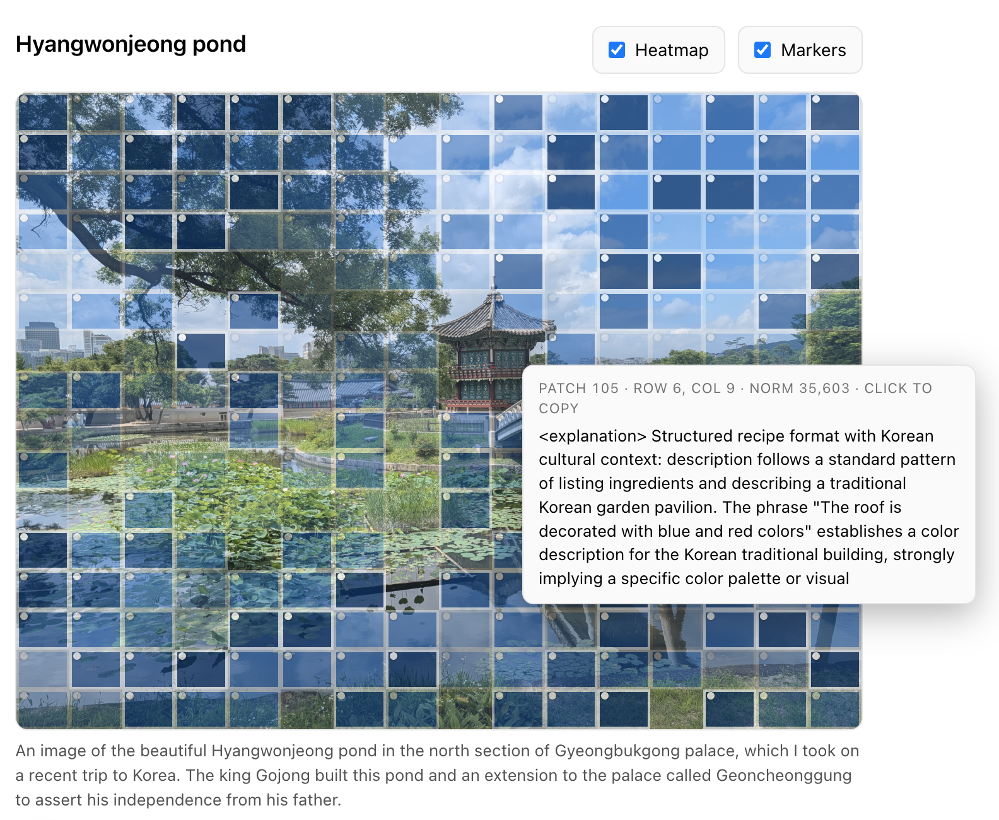

## Gemma 3 Visual NLA Inference

This is a light adapter around [nla-inference](https://github.com/kitft/nla-inference) for image NLA inference with Gemma3.

The orginal NLA was trained on text so the explanations are kinda jank and hallucinated, but quite fun to look at. 


## Quickstart

First, make sure you have a system with at least 100GB disk and 24GB VRAM. Also install uv

```sh
uv sync

# download actor (activation verbalizer) weights from anthropic
uv run hf download kitft/nla-gemma3-12b-L32-av  --local-dir ./checkpoints/gemma3_12b_L32_av

#run example
uv run python main.py examples/pond.jpg --top-k 256 #256 is all patches for gemma3
```

